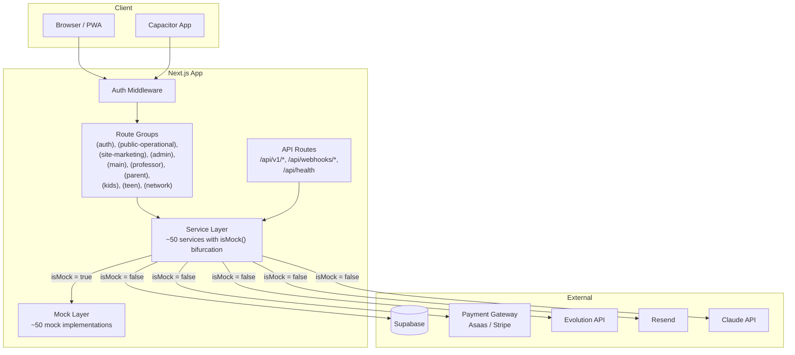

# BlackBelt v2 — Architecture

## Overview

BlackBelt v2 is a multi-tenant SaaS platform for martial arts academy management. Built with Next.js 14 App Router, TypeScript strict mode, and Tailwind CSS.

## Stack

| Layer | Technology | Justification |
|-------|-----------|---------------|
| Framework | Next.js 14 (App Router) | SSR/SSG, API routes, middleware, file-based routing |
| Language | TypeScript (strict) | Type safety across the entire stack |
| Styling | Tailwind CSS v3 | Utility-first, design token system (bb-*, belt-*) |
| State | React Context + hooks | Lightweight, no external state lib needed |
| Database | Supabase (PostgreSQL) | Auth, RLS, realtime, storage, edge functions |
| Payments | Strategy Pattern (Mock/Asaas/Stripe) | Pluggable gateway architecture |
| i18n | next-intl | 3 locales (pt-BR, en-US, es), cookie-based detection |
| Charts | Recharts | Dynamic imports for bundle optimization |
| Mobile | Capacitor | Native iOS/Android from the same codebase |
| PWA | Service Worker + manifest | Offline support, install prompt |

## Architecture Diagram



## Key Patterns

### 1. Mock-Driven Development (isMock() Bifurcation)
Every service follows the same pattern:
```typescript
export async function doSomething(id: string): Promise<Result> {
  try {
    if (isMock()) {
      const { mockDoSomething } = await import('@/lib/mocks/something.mock');
      return mockDoSomething(id);
    }
    const res = await fetch('/api/...');
    return res.json();
  } catch (error) { handleServiceError(error, 'context'); }
}
```

### 2. Strategy Pattern (Payment Gateways)
`PaymentGateway` interface with `MockGateway`, `AsaasGateway`, `StripeGateway` implementations. Factory function `getPaymentGateway()` selects based on `PAYMENT_GATEWAY` env var.

### 3. forwardRef + displayName
All shared UI components use `forwardRef` with explicit `displayName` for React DevTools compatibility.

### 4. Route Group Authorization
- `(admin)` — admin role
- `(professor)` — professor role
- `(main)` — aluno_adulto role
- `(teen)` — aluno_teen role
- `(kids)` — aluno_kids role
- `(parent)` — responsavel role
- `(public-operational)` — no auth required, but still part of the product
- `(site-marketing)` — temporary redirects to `blackbelts.com.br`
- `(network)` — multi-academy owner

### 5. Design Tokens
Custom Tailwind tokens: `bb-red`, `bb-white`, `bb-gray-*`, `belt-*` colors for consistent theming.

## Trade-offs

| Decision | Rationale |
|----------|-----------|
| No external state management | React Context sufficient for current complexity |
| Cookie-based locale (not URL prefix) | Preserves existing route structure with 8 route groups |
| Mock-first development | Enables full frontend dev without backend dependency |
| Monorepo (no separate packages) | Simplicity over modularity for current team size |
| Recharts with dynamic imports | Balance between features and bundle size |
